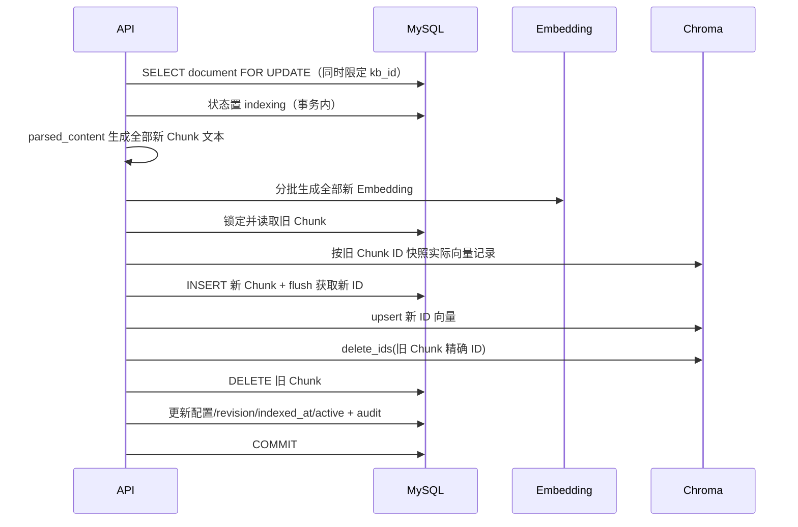
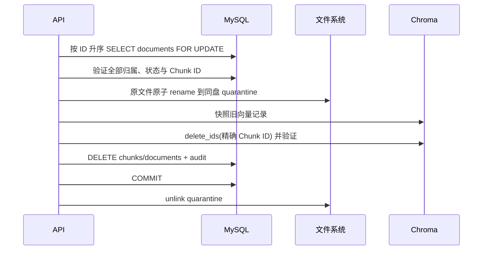

# 知识库文档管理第一阶段

## 1. 目标与边界

本阶段是在现有知识库、上传、MySQL、Chroma collection 隔离、多知识库和失败回滚能力上的增量开发。MySQL 继续作为文档与 Chunk 的事实来源，原文件作为可追溯来源，`parsed_content` 作为可重放的稳定中间产物，Chroma 只保存可重建的派生向量索引。

本阶段交付：结构化解析、自定义字符拆分、无副作用预览、文档列表与筛选分页、单删/批删、文档级重新索引，以及对应管理界面和测试。

本阶段不做 OCR、复杂 PDF 版面恢复、父子 Chunk、Chunk 人工编辑、异步任务队列或知识库架构重写。扫描型 PDF 没有可提取文本时必须明确失败；不能宣称 pypdf 能完整恢复复杂排版。

## 2. 审查范围与结论

编码前已完整审查：

- `app/services/knowledge.py`
- `app/services/vector_store.py`
- `app/models/entities.py`
- `app/api/routes.py`
- `app/schemas/`
- `migrations/versions/`
- `tests/`
- `frontend/src/app/admin/docs/`
- `frontend/src/features/admin/components/document-upload-panel.tsx`
- `frontend/src/features/admin/api/admin-api.ts`
- `frontend/src/features/admin/hooks/use-knowledge-actions.ts`
- `frontend/src/features/admin/types/admin-types.ts`

同时检查了 `app/core/config.py`、`app/core/database.py`、Docker Compose、入口迁移脚本、前端查询配置和现有知识库管理页面，确认项目显式禁止 SQLite，生产与测试链路均以 MySQL 为数据库。

### 2.1 现有能力

- 知识库使用 `mindbridge_kb_{id}` 独立 Chroma collection，collection 名由 MySQL 管理。
- 知识库删除已有行锁、删除屏障、引用检查、审计日志和失败重试状态。
- 文档上传接口已受 `require_admin` 保护，支持 multipart、流式落临时文件、50 MB 上限和异常清理。
- 支持 TXT、Markdown、PDF、DOCX；TXT/Markdown 已使用 `utf-8-sig`，兼容 UTF-8 与 UTF-8-SIG。
- 文件夹上传保存安全的 NFC 相对路径，拒绝绝对路径、路径穿越、控制字符和超长路径。
- 文档唯一性按 `(knowledge_base_id, relative_path)` 保证。
- 上传时先创建 MySQL 文档与 Chunk，flush 获得 Chunk ID，再写 Chroma；新增文档失败会回滚数据库、删除新文件并按新 Chunk 精确 ID 清理新向量。
- Chroma 精确 ID 查询可保存实际生效的 document、metadata 与 embedding，作为补偿数据来源；`KnowledgeChunk.embedding_json` 仍保留用于既有流程。
- 知识库列表已有聚合子查询模式，可复用于文档列表，避免 N+1。
- 前端上传页已有多文件、文件夹、相对路径、固定双并发、逐文件进度、失败重试和 active 知识库搜索。
- 前端已有 Ant Design Table、筛选、分页、Popconfirm、Modal、Drawer、错误重试和 React Query 模式可复用。

### 2.2 缺失能力与已识别风险

- `knowledge.py` 已达约 885 行，上传、解析、清洗、拆分、索引和知识库 CRUD 混在同一文件。
- 当前 `chunk_blocks` 使用字符窗口硬切，并通过 `re.sub(r"\s+", " ", text)` 压平全部换行，破坏 Markdown 标题、列表、表格和段落。
- DOCX 没有保留 Heading/list 样式，段落与表格分开遍历，丢失正文顺序；表格只是制表符文本。
- PDF 页边界在后续清洗中丢失；扫描型 PDF 只能得到泛化的空文档错误，没有页级 warning。
- 没有统一 `ParsedDocument`，没有持久化解析文本、解析器版本、内容哈希或逐文档拆分配置。
- 没有文档列表、预览、文档级 reindex、单删、批删或对应 DTO。
- Chroma 只有按 `document_id` metadata 删除，文档 reindex 时若先写新向量再按 document 删除，会把新旧向量一起误删。
- 现有 `replace_existing` 会在新索引成功前删除旧向量、旧原文件和旧 DB 文档。后续失败时 MySQL 可以回滚，但旧向量与旧文件无法恢复；新实现不得沿用该时序。
- MySQL 与 Chroma/文件系统无法加入同一原子事务，只能通过行锁、状态、精确 ID、快照和补偿实现 saga 语义。
- 前端 `uploadKnowledgeDocument(id, file, relativePath, onProgress)` 被多个入口调用，新增参数必须保持原四参数兼容。
- 前端文档列表新增后，直接调用上传 API 的上传面板必须显式刷新文档列表与知识库统计缓存。

### 2.3 成熟产品与依赖设计参考

- [RAGFlow PDF parser 指南](https://github.com/infiniflow/ragflow/blob/main/docs/guides/dataset/select_pdf_parser.md) 将解析器与 Chunk 方法解耦；本项目采用 parser → cleaner → splitter → embedding/indexing 分层，但不引入 DeepDoc/OCR。
- [RAGFlow](https://github.com/infiniflow/ragflow) 的 Chunk 可视化与人工干预启发“参数编辑 → 无副作用预览 → 明确应用并重新索引”的交互；本阶段不实现单 Chunk 编辑。
- [Dify 文档接口](https://docs.dify.ai/api-reference/documents/get-document) 和 [Chunk 接口](https://docs.dify.ai/api-reference/chunks/create-chunks) 体现知识库 → 文档 → Chunk 三级资源；本项目保持 MySQL 为这三级资源的管理真相，不从 Chroma 反推列表。
- [Dify 文件建文档接口](https://docs.dify.ai/api-reference/documents/create-document-by-file) 将处理规则随文档保存；本项目的全局 settings 只提供上传缺省值，生效值固化到每个文档。
- [AnythingLLM](https://github.com/mintplex-labs/anything-llm) 将采集解析与 workspace/向量入库分层；本项目不拆进程，但拆分 Python 模块并保留统一编排服务。
- [LangChain RecursiveCharacterTextSplitter 指南](https://docs.langchain.com/oss/python/integrations/splitters/recursive_text_splitter) 明确默认长度单位为字符，并建议无空格语言加入全角标点；本项目前后端统一使用“字符”，不使用 Token 名义。
- [Chroma Collection API](https://docs.trychroma.com/reference/python/collection) 支持按精确 `ids` 的 get/upsert/delete；reindex/delete 使用旧 Chunk 精确 ID，不以 `document_id` filter 删除新旧混合记录。

## 3. 目标模块结构

```text
app/services/
├── knowledge.py              # 知识库 CRUD、RAG 检索、兼容 facade
├── document_parser.py        # 格式识别、结构化解析、最小清洗、ParsedDocument
├── document_splitter.py      # 参数校验、splitter factory、拆分/预览
├── document_storage.py       # 临时文件、最终存储、删除隔离与文件补偿
├── document_catalog.py       # 文档聚合列表、作用域校验、无副作用预览
├── document_indexing.py      # embedding、精确向量快照、写入与恢复
├── document_transactions.py  # 提交结果验证，避免 ACK 不确定时误补偿
├── document_audit.py         # 管理操作与失败补偿审计
├── document_management.py    # 上传、reindex、删除和 rebuild 编排
└── vector_store.py           # Chroma 精确 ID 原语和现有 collection 操作
```

职责约束：

- 文件接收与存储只处理大小限制、安全路径、临时文件、最终路径和隔离区移动。
- 解析器只把文件转换为 `ParsedDocument`，不写数据库或向量库。
- 清洗器只删除确定无意义字符，不改变文档结构。
- splitter 只校验配置并按相同算法生成 Chunk；上传、预览和 reindex 必须调用同一入口。
- document management 负责 MySQL、Chroma、文件系统之间的编排、行锁、审计和补偿。
- `knowledge.py` 保留已有 `KnowledgeBaseService`、`KnowledgeService` 与兼容导出，避免破坏现有调用。

## 4. 统一解析结果与解析规则

```python
@dataclass(frozen=True)
class ParsedDocument:
    text: str
    parser_name: str
    parser_version: str
    metadata: dict[str, object]
    page_count: int | None
    warnings: list[str]
```

解析器版本由代码常量管理，上传响应返回 parser 名称；`content_hash` 对最终清洗后的 UTF-8 文本做 SHA-256。

### 4.1 最小清洗

- CRLF/CR 统一为 LF。
- 删除除 `\n`、`\t` 外的非法 C0/C1 控制字符。
- 删除零宽字符和异常替换字符 U+FFFD，并产生 warning。
- 连续三个以上空行压缩为两个空行。
- 只去除全文首尾多余空白，不压平正文内部空白。
- 保留换行、Markdown 标题、列表、表格、中文标点和页边界标记。

### 4.2 TXT 与 Markdown

- 使用 `utf-8-sig` 解码，同时兼容 UTF-8 和 UTF-8-SIG。
- 原样保留标题符号、列表符号、段落与换行。
- 非 UTF-8 输入返回 422。

### 4.3 DOCX

- 先检查 ZIP 条目数、总解压大小和 `[Content_Types].xml`，保留现有 zip bomb 防护。
- 按 `document.element.body` 顺序遍历 paragraph/table，保留正文真实顺序。
- Heading 1..9 转换为相应 Markdown `#` 标题。
- 列表段落根据 numbering/style 尽可能转换为 `- ` 或 `1. `。
- 普通段落之间保留段落边界；连续空段落受清洗器约束。
- 表格转换为稳定 Markdown 表格；第一行作为表头，无行时使用稳定行列文本。
- 保留中文内容。

### 4.4 PDF

- 使用现有 pypdf，按页 `extract_text()`。
- 每页保留页内换行，并在页之间加入稳定的页边界标记。
- `metadata` 记录总页数和无文本页；无文本页产生 warning。
- 全文没有有效文本时返回明确 422：“PDF 未提取到文本，可能是扫描型 PDF；当前阶段不支持 OCR”。
- 不承诺恢复复杂 PDF 版式。

## 5. 数据模型变更

继续扩展 `KnowledgeDocument`，不新建重复文档主表，也不保存 `chunk_count`：

| 字段 | MySQL 类型 | 约束/默认 | 用途 |
| --- | --- | --- | --- |
| `parsed_content` | LONGTEXT | 非空；历史行回填 | 当前生效的结构化解析文本 |
| `content_hash` | CHAR(64) | 非空 | 清洗后文本 SHA-256 |
| `parser_name` | VARCHAR(64) | 非空 | 解析器名 |
| `parser_version` | VARCHAR(32) | 非空 | 解析器版本 |
| `splitter_type` | VARCHAR(64) | `recursive_character` | 可扩展拆分器类型 |
| `chunk_size` | INT | 512 | 每文档生效字符数 |
| `chunk_overlap` | INT | 64 | 每文档生效重叠字符数 |
| `revision` | INT | 1 | 文档索引修订号 |
| `indexed_at` | DATETIME | 可空 | 最近成功完成索引时间 |
| `mime_type` | VARCHAR(255) | 可空 | 上传 Content-Type/推断 MIME |

迁移策略：

1. 新迁移接在 `20260713_0004` 后。
2. 先以可空列/服务器默认添加，避免历史行立即失败。
3. 逐文档按 `knowledge_chunks.source_index` 查询并以双换行拼接历史 Chunk，避免 MySQL `GROUP_CONCAT` 长度截断。
4. 对回填文本计算 SHA-256；历史 parser 标记为 `legacy_chunks`，版本 `1`；拆分配置使用系统当前默认 512/64；active 历史文档的 `indexed_at` 使用 `updated_at`。
5. 完成回填后将必须字段改为非空并保留合理 server default，确保应用与迁移兼容滚动启动。
6. downgrade 只删除本迁移新增列；在真实 MySQL 执行 upgrade → downgrade → upgrade。

历史文档列表和检索继续工作；若极端历史行既无原文件也无 Chunk，`parsed_content` 为空，预览/reindex 返回明确 422，不影响列表和删除。

## 6. 文本拆分

新增并锁定 `langchain-text-splitters` 兼容版本，唯一开放类型为 `recursive_character`。

统一配置：

- `100 <= chunk_size <= 4000`
- `0 <= chunk_overlap <= 1000`
- `chunk_overlap < chunk_size`
- `splitter_type == "recursive_character"`
- `length_function=len`，所有界面和接口描述只使用“字符”

separators 从结构边界到字符兜底依次考虑：

```python
[
    "\n# ", "\n## ", "\n### ", "\n#### ", "\n##### ", "\n###### ",
    "\n\n", "\n", "。", "？", "！", "；", ". ", "? ", "! ", "; ",
    " ", "",
]
```

使用 `keep_separator=True`，并通过快照式断言保证标题、列表和中文标点不被清洗器破坏。LangChain overlap 是目标重叠，不在 UI 宣称每个 Chunk 都精确重叠固定字符。

## 7. API 契约

所有接口都要求管理员权限；文档查询始终同时按 URL `knowledge_base_id` 和 `document_id` 限定，跨知识库与不存在统一返回 404。

### 7.1 兼容上传

`POST /api/admin/knowledge-bases/{knowledge_base_id}/documents`

multipart Form：

- `file`：必填
- `relative_path`：可选，保留现有行为
- `chunk_size`：可选，缺省取 settings
- `chunk_overlap`：可选，缺省取 settings
- `splitter_type`：可选，缺省 `recursive_character`

响应保留原字段 `id/knowledgeBaseId/fileName/relativePath/fileSize/chunks/indexStatus`，新增：

```json
{
  "parserName": "markdown",
  "splitterType": "recursive_character",
  "chunkSize": 512,
  "chunkOverlap": 64,
  "contentHash": "sha256...",
  "warnings": []
}
```

### 7.2 文档列表

`GET /api/admin/knowledge-bases/{knowledge_base_id}/documents`

查询参数：`name/status/created_from/created_to/page/page_size/sort_by/sort_order`。`page_size` 最大 100；默认 `created_at desc, id desc`。允许排序字段采用白名单：`created_at/updated_at/file_name/file_size/index_status/indexed_at/chunk_count`。

响应：

```json
{
  "items": [{
    "id": 1,
    "knowledgeBaseId": 2,
    "fileName": "guide.md",
    "relativePath": "docs/guide.md",
    "fileType": "md",
    "mimeType": "text/markdown",
    "fileSize": 1024,
    "indexStatus": "active",
    "errorMessage": "",
    "chunkCount": 8,
    "chunkSize": 512,
    "chunkOverlap": 64,
    "splitterType": "recursive_character",
    "createdAt": "...",
    "updatedAt": "...",
    "indexedAt": "..."
  }],
  "total": 1,
  "page": 1,
  "pageSize": 20
}
```

`chunkCount` 来自 MySQL `KnowledgeChunk.document_id GROUP BY` 聚合子查询；列表不访问 Chroma。

### 7.3 拆分预览

`POST /api/admin/knowledge-bases/{knowledge_base_id}/documents/{document_id}/split-preview`

请求：

```json
{"chunkSize": 400, "chunkOverlap": 40, "splitterType": "recursive_character"}
```

响应最多返回 settings 指定的 200 个 Chunk，但 `totalChunks` 表示完整拆分总数：

```json
{
  "totalChunks": 245,
  "items": [{"index": 0, "content": "...", "charCount": 398}],
  "truncated": true
}
```

该接口只读取 `parsed_content` 并调用统一 splitter，不 flush、不 commit、不写 Chroma、不写审计状态。

### 7.4 应用配置并重新索引

`POST /api/admin/knowledge-bases/{knowledge_base_id}/documents/{document_id}/reindex`

请求与 split-preview 相同。响应包含文档 ID、新 revision、Chunk 数、拆分配置、状态和 indexedAt。

### 7.5 删除

- 单删：`DELETE /api/admin/knowledge-bases/{knowledge_base_id}/documents/{document_id}`
- 批删：`POST /api/admin/knowledge-bases/{knowledge_base_id}/documents/batch-delete`

批删请求：

```json
{"documentIds": [1, 2, 3]}
```

一次 1～100 个，输入去重；先按升序一次锁定并验证所有文档均存在、属于指定知识库且非 indexing/deleting，再执行外部资源步骤。批量接口为全成功或全失败：任一验证、向量删除、文件隔离、数据库提交失败，整批回滚并补偿。跨知识库/缺失 ID 返回 404；并发 indexing/reindex/delete 返回 409。重复单删采用明确 404 语义。

## 8. 索引更新时序



关键约束：

- 生成全部新 embedding 成功后才写任何新向量。
- 新 Chunk 使用数据库新 ID，因此新旧向量可短暂共存。
- 旧向量只按旧 Chunk 精确 ID 删除，禁止 `where={document_id}`。
- `active` 和新配置只在 Chroma 可读、旧向量已删除后与 DB 事务一同提交。
- Chroma 禁用且允许 BM25 fallback 时，流程跳过向量步骤，但 MySQL Chunk 仍完整替换。

## 9. 删除时序



同盘 rename 可在提交前恢复；commit 后 quarantine 清理失败必须记录告警/审计，不能影响数据库和向量已完成的一致删除，也不能静默丢失清理信息。

## 10. 失败补偿策略

### 10.1 上传

- 解析/拆分/全部 embedding 失败时不创建持久文档。
- DB flush 或 Chroma upsert 失败：rollback DB、按新 Chunk 精确 ID 删除新向量、删除新落盘文件、记录 upload error 审计。
- 新文档成功前不删除同路径历史文档；`replace_existing` 后续改为统一 document-level replace/reindex 或安全的双版本流程。

### 10.2 reindex

- 保存旧文档状态、配置、Chunk 行和旧 Chroma records（document、metadata、embedding）。
- 任一步骤失败先按新 Chunk 精确 ID 清理新向量，再 rollback MySQL，使旧 Chunk/配置/状态恢复。
- 若旧向量已经删除，使用 Chroma 快照精确 upsert 旧 ID；不存在的旧向量不会被凭空生成。
- 补偿成功后旧 Chunk 继续可用，记录 reindex failed 审计但不覆盖旧 active 状态。
- 补偿也失败时不得静默：文档设为 error、保存安全错误摘要、审计记录旧/新 revision 与失败阶段；BM25 仍可使用旧 DB Chunk。

### 10.3 单删/批删

- commit 前失败：rollback DB、恢复已删旧向量、quarantine 文件 rename 回原路径。
- 批量操作共享一个事务与补偿上下文，任何文档失败都恢复整批。
- 不采用“先提交 DB 再尽力删向量”，避免数据库消失而向量残留。
- 不采用“直接 unlink 原文件再删 DB”，避免回滚后数据库仍在但文件丢失。

### 10.4 不可消除边界

MySQL、嵌入式 Chroma 和文件系统没有分布式事务。进程在外部写成功、补偿执行前被强制终止时仍可能短暂不一致。第一阶段通过行锁、状态、审计、精确 ID、可恢复文件隔离和同步补偿降低风险；持久化 operation/outbox 与启动恢复扫描留作后续增强，不对当前同步 saga 宣称数学意义原子事务。

## 11. 前端页面结构

```text
/admin/docs
└── DocumentManagementWorkspace (Tabs)
    ├── 上传文档
    │   └── DocumentUploadPanel（保留现有队列）
    │       ├── 目标知识库
    │       ├── chunkSize / chunkOverlap（单位：字符）
    │       ├── 多文件/文件夹/拖拽
    │       └── 双并发/进度/失败重试
    └── 文档管理
        └── DocumentListPanel
            ├── 知识库选择
            ├── 名称/日期/状态筛选
            ├── Ant Design Table + 服务端分页/排序/行选择
            ├── 单删 Popconfirm / 批删 Modal.confirm
            └── DocumentSplitDrawer
                ├── 拆分参数表单
                ├── 无副作用预览
                ├── 编号 Chunk Card（white-space: pre-wrap）
                └── 应用配置并重新索引
```

表格列：文档名称与相对路径、大小、上传时间、Chunk 数、拆分配置、状态、操作。loading、empty、error 和重试均明确展示；indexing/deleting 禁用冲突操作。

React Query key 分离知识库与文档：上传、reindex、单删、批删成功后同时 invalidate 指定知识库文档列表、知识库列表和知识库详情；split-preview 是只读 mutation，不刷新缓存。分页切换保留旧数据减少闪烁。

## 12. 测试矩阵

| 层级 | 场景 | 关键断言 |
| --- | --- | --- |
| Parser 单测 | TXT/MD UTF-8 与 UTF-8-SIG | 标题、列表、段落、换行和中文标点保留 |
| Parser 单测 | 控制/零宽/U+FFFD/连续空行 | 只删除确定无意义字符，warning 正确 |
| Parser 单测 | DOCX heading/正文/list/table/中文 | Markdown 结构正确，body 顺序保持，空段落有界 |
| Parser 单测 | PDF 多页 | 页数、页边界、页内换行和 warning 正确 |
| Parser 单测 | 扫描/空 PDF | 明确 422，不产生 0 Chunk 成功文档 |
| Splitter 单测 | 参数边界 | size 100..4000、overlap 0..1000、overlap<size、类型白名单 |
| Splitter 单测 | 中文/Markdown | preview 与实际上传/reindex Chunk 完全一致，单位为字符 |
| API/MySQL | 自定义上传 | Form 参数、响应扩展字段、文档配置与 parsed_content/hash 落库 |
| API/MySQL | 上传兼容 | 原字段、relative_path、多文件夹路径、旧前端调用继续工作 |
| API/MySQL | 文档列表 | 名称/状态/日期、分页、排序、稳定次序、聚合 chunkCount、无 N+1 |
| API/MySQL/Chroma | split-preview | 返回上限/truncated/charCount；前后 DB/Chroma/hash/revision 不变 |
| API/MySQL/Chroma | reindex 成功 | 新 Chunk 可检索，旧精确向量 ID 消失，配置/revision/indexedAt 更新 |
| 故障注入 | embedding/upsert/delete/commit 失败 | 新向量清理，旧 Chunk/向量/配置/active 状态可用 |
| API/MySQL/Chroma/FS | 单删 | document/chunks/vector/file 均不存在，审计存在 |
| API/MySQL/Chroma/FS | 批删 | 1..100 全成功；任一非法/外部失败整批补偿 |
| 权限/隔离 | 跨知识库访问 | list 范围正确；preview/reindex/delete 返回 404 |
| 权限 | 普通学生 | 所有新增管理员接口返回 403 |
| Migration/MySQL | upgrade/downgrade/upgrade | 真实 MySQL 执行成功，历史文档仍能列表/检索 |
| 前端单测 | Table loading/empty/error | 状态和重试入口正确 |
| 前端单测 | 搜索/日期/状态/分页/排序 | 查询参数和页码重置正确 |
| 前端单测 | 单删/批删 | 确认前不执行，确认后传正确 KB/document IDs 并刷新缓存 |
| 前端单测 | 预览/reindex | Chunk 编号、字符数、换行、truncated 和应用动作正确 |
| 前端回归 | 上传 | 自定义 FormData + relative path；双并发、进度、失败重试不退化 |
| 前端质量 | lint/typecheck/build/tests | 所有命令通过 |

后端集成测试继续在 Docker Python 3.12、真实 MySQL 与现有 Chroma 持久化环境运行，不引入 SQLite、内存数据库或 FastAPI TestClient 兜底。

## 13. 实施顺序

1. 新增 parser/splitter 模块与纯单元测试，锁定 `langchain-text-splitters`。
2. 扩展 `KnowledgeDocument` 并新增 Alembic 迁移，在真实 MySQL 验证可逆性。
3. 为 vector store 增加精确 ID get/delete/restore 原语。
4. 新建 document management 服务，迁移上传编排并实现 list/preview/reindex/delete/batch-delete。
5. 增加 DTO 和路由，执行权限、跨库和失败补偿集成测试。
6. 增量升级 `/admin/docs`，保持旧上传签名和知识库 Drawer 兼容。
7. 补齐前端测试，运行 lint、typecheck、build 和现有测试。
8. 更新 README、`.env.example`、接口验证命令与交付记录，完成 diff 审查后提交 PR。
